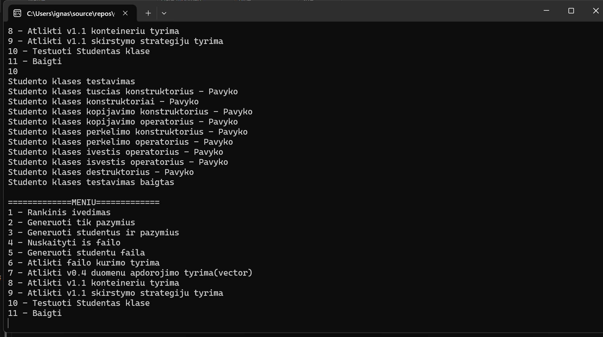

# Studentų pažymių skaičiavimo programa

## Programos funkcijos

Programa leidžia:

- rankiniu būdu įvesti studentų duomenis;
- generuoti pažymius;
- generuoti studentus ir jų pažymius;
- nuskaityti studentų duomenis iš failo;
- generuoti studentų failus;
- skaičiuoti galutinį balą pagal vidurkį arba medianą;
- rūšiuoti studentus pagal vardą, pavardę arba rezultatą;
- skirstyti studentus į dvi grupes;
- atlikti veikimo spartos tyrimus.

---

## Reikalavimai

- C++ kompiliatorius su C++17 palaikymu;
- CMake;
- Git.

---

## Programos įdiegimas ir paleidimas

Projekto atsisiuntimas:

```bash
git clone https://github.com/Boljerr/OOP_2.git
cd OOP_2
```

Kompiliavimas su CMake:

```bash
mkdir build
cd build
cmake ..
cmake --build .
```

Windows aplinkoje programa paleidžiama, pvz.:

```bash
.\Release\StudentaiV1.exe
```

Programa taip pat gali būti paleidžiama iš tos vietos, kurioje CMake sugeneruoja `.exe` failą.

---

## Meniu

```text
1 - Rankinis ivedimas
2 - Generuoti tik pazymius
3 - Generuoti studentus ir pazymius
4 - Nuskaityti is failo
5 - Generuoti studentu faila
6 - Atlikti failo kurimo tyrima
7 - Atlikti v0.4 duomenu apdorojimo tyrima(vector)
8 - Atlikti v1.1 konteineriu tyrima
9 - Atlikti v1.1 skirstymo strategiju tyrima
10 - Baigti
```

## v1.2

Šioje versijoje buvo praplėsta `Studentas` klasė. Pridėta penkių metodų taisyklė, įvesties / išvesties operatoriai ir rankiniai testai.

### Atlikti pakeitimai

| Pakeitimas | Aprašymas |
|---|---|
| Rule of five | Realizuotas destruktorius, kopijavimo konstruktorius, kopijavimo operatorius, perkėlimo konstruktorius ir perkėlimo operatorius |
| Įvesties operatorius `>>` | Leidžia nuskaityti `Studentas` objektą iš įvesties srauto |
| Išvesties operatorius `<<` | Leidžia išvesti `Studentas` objektą į ekraną arba failą |
| `read()` metodas | Naudojamas studento duomenų nuskaitymui |
| `print()` metodas | Naudojamas studento duomenų išvedimui |
| Testai | Pridėti rankiniai testai `Studentas` klasei |

### Rule of five

`Studentas` klasei buvo realizuoti visi penki metodai:

```cpp
~Studentas();
Studentas(const Studentas& kitas);
Studentas& operator=(const Studentas& kitas);
Studentas(Studentas&& kitas) noexcept;
Studentas& operator=(Studentas&& kitas) noexcept;
```

Nors klasėje naudojami `std::string` ir `std::vector`, kurie patys tvarko atmintį, šie metodai buvo realizuoti rankiniu būdu pagal v1.2 užduoties reikalavimus.

### Įvesties ir išvesties operatoriai

Buvo realizuoti šie operatoriai:

```cpp
std::istream& operator>>(std::istream& in, Studentas& studentas);
std::ostream& operator<<(std::ostream& out, const Studentas& studentas);
```

Įvesties operatorius naudoja `read()` metodą, o išvesties operatorius naudoja `print()` metodą. Taip `Studentas` objektą galima nuskaityti iš srauto ir išvesti į ekraną arba failą.

Pavyzdinė įvestis:

```txt
Petras Petraitis 6 7 8 9
```

Šiuo atveju paskutinis skaičius yra egzamino pažymys, o prieš jį esantys skaičiai yra namų darbų pažymiai.


### Testavimas

Buvo pridėti rankiniai testai, kurie patikrina konstruktorius, kopijavimo metodus, perkėlimo metodus, įvesties / išvesties operatorius ir destruktorių.

Testavimo rezultatai:



### v1.2 išvada

Šioje versijoje `Studentas` klasė tapo pilnesnė ir patogesnė naudoti. Objektus galima kopijuoti, perkelti, nuskaityti naudojant `>>` operatorių ir išvesti naudojant `<<` operatorių.

## Relizų aprašas

### v1.1

- `Studentas` struktūra pakeista į klasę.
- Studentų duomenys perkelti į privačius laukus.
- Pridėti getteriai ir setteriai.
- Realizuoti konstruktoriai ir destruktorius.
- Atnaujintos funkcijos, kurios dirba su `Studentas` objektais.
- Atliktas `struct` ir `class` versijų palyginimas.
- Atlikta analizė su `O1`, `O2` ir `O3` optimizavimo flag'ais.
- README faile pateikti greičio ir `.exe` dydžio rezultatai.

### v1.0

- Pridėtas darbas su trimis konteineriais:
  - `std::vector`;
  - `std::list`;
  - `std::deque`.
- Pridėtos trys studentų skirstymo strategijos.
- Atliktas konteinerių tyrimas.
- Atliktas skirstymo strategijų tyrimas.
- Paruoštas `CMakeLists.txt`.

### v0.4

- Pridėtas studentų failų generavimas.
- Pridėtas studentų skirstymas į dvi grupes.
- Atliktas pradinis veikimo spartos tyrimas su `std::vector`.

### v0.3

- Patobulinta įvesties validacija.
- Pridėtas klaidų tikrinimas.
- Kodas išskaidytas į `.h` ir `.cpp` failus.

### v0.2

- Pridėtas duomenų nuskaitymas iš failo.
- Pridėtas studentų rūšiavimas.

### v0.1

- Realizuotas rankinis studentų duomenų įvedimas.
- Pridėtas galutinio balo skaičiavimas pagal vidurkį arba medianą.

### v.pradinė

- Sukurta pradinė studento duomenų struktūra.
- Realizuotas pradinis vidurkio ir medianos skaičiavimas.