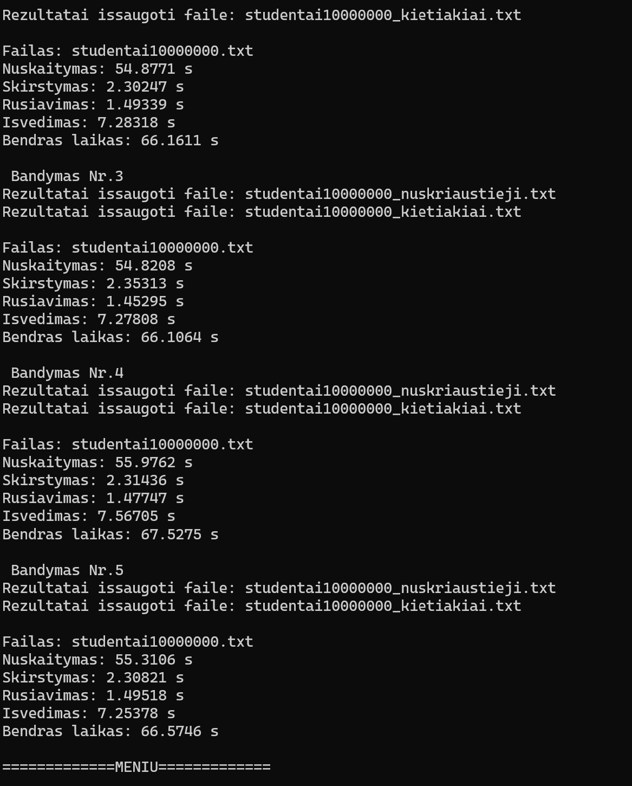

# v0.4 Programos spartos tyrimas

## 1 Tyrimas – Failų kūrimo sparta

Šio tyrimo tikslas – išmatuoti, kiek laiko užtrunka sugeneruoti studentų duomenų failus su skirtingu įrašų kiekiu.

Testavimas atliktas naudojant programos **Release** versiją.  
Kiekvienas failas buvo generuojamas **3 kartus**, o galutinis rezultatas pateikiamas kaip **laikų vidurkis**.

Failuose generuojami studentai su šabloniniais vardais ir pavardėmis:

Kiekvienam studentui sugeneruojama **15 namų darbų pažymių** ir **egzamino pažymys**.

---

## Testavimo rezultatai

| Failas | Studentų skaičius | 1 bandymas (s) | 2 bandymas (s) | 3 bandymas (s) | Vidurkis (s) |
|------|------|------|------|------|------|
| studentai1000.txt | 1 000 | 0.0067418 | 0.0064339 | 0.0066288 | 0.00660 |
| studentai10000.txt | 10 000 | 0.0561453 | 0.0487378 | 0.0497423 | 0.0515 |
| studentai100000.txt | 100 000 | 0.45929 | 0.44882 | 0.440447 | 0.4495 |
| studentai1000000.txt | 1 000 000 | 4.40415 | 4.39807 | 4.48562 | 4.429 |
| studentai10000000.txt | 10 000 000 | 44.0179 | 44.0862 | 44.4223 | 44.176 |

---

## Išvados

Didėjant studentų įrašų skaičiui, failų generavimo laikas didėja beveik proporcingai.  
Tai rodo, kad failų generavimo algoritmas turi **linijinę laiko sudėtingumo priklausomybę O(n)**.

## 2 Tyrimas – Duomenų apdorojimo sparta

### studentai100.txt (100 įrašų)

Testas kartotas 10 kartų.

| Operacija | Vidutinis laikas (s) |
|---|---|
| Duomenų nuskaitymas iš failo | 0.000761 |
| Studentų skirstymas į kategorijas | 0.000016 |
| Studentų rūšiavimas | 0.000010 |
| Rezultatų išvedimas į failus | 0.002423 |
| **Bendras programos laikas** | **0.00321** |

### studentai1000.txt (1000 irasu)  
Programa vykdyta **10 kartų**, pateikiami vidutiniai laikai.

| Operacija | Vidutinis laikas (s) |
|---|---|
| Duomenų nuskaitymas iš failo | 0.00594 |
| Studentų skirstymas į kategorijas | 0.000162 |
| Studentų rūšiavimas | 0.000202 |
| Rezultatų išvedimas į failus | 0.00515 |
| **Bendras programos laikas** | **0.0115** |

### studentai10000.txt (10 000 įrašų)

Testas kartotas 10 kartų, pateikiamas vidurkis.

| Operacija | Vidutinis laikas (s) |
|---|---|
| Duomenų nuskaitymas iš failo | 0.05467 |
| Studentų skirstymas į kategorijas | 0.002189 |
| Studentų rūšiavimas | 0.002575 |
| Rezultatų išvedimas į failus | 0.01127 |
| **Bendras programos laikas** | **0.07089** |

### studentai100000.txt (100 000 įrašų)

Testas kartotas 10 kartų, pateikiamas vidurkis.

| Operacija | Vidutinis laikas (s) |
|---|---|
| Duomenų nuskaitymas iš failo | 0.575736 |
| Studentų skirstymas į kategorijas | 0.019338 |
| Studentų rūšiavimas | 0.035469 |
| Rezultatų išvedimas į failus | 0.091561 |
| **Bendras programos laikas** | **0.744990** |

### studentai1000000.txt (1 000 000 įrašų)

Testas kartotas 10 kartų, pateikiamas vidurkis.

| Operacija | Vidutinis laikas (s) |
|---|---|
| Duomenų nuskaitymas iš failo | 5.52820 |
| Studentų skirstymas į kategorijas | 0.21710 |
| Studentų rūšiavimas | 0.43468 |
| Rezultatų išvedimas į failus | 0.79904 |
| **Bendras programos laikas** | **6.99734** |

### studentai10000000.txt (10 000 000 įrašų)

Testas kartotas 5 kartus, pateikiamas vidurkis.

| Operacija | Vidutinis laikas (s) |
|---|---|
| Duomenų nuskaitymas iš failo | 56.15856 |
| Studentų skirstymas į kategorijas | 2.39562 |
| Studentų rūšiavimas | 1.48498 |
| Rezultatų išvedimas į failus | 7.32110 |
| **Bendras programos laikas** | **67.56386** |

## Tyrimo išvados

Didėjant studentų įrašų kiekiui, programos vykdymo laikas didėja beveik proporcingai. 
Didžiausią laiko dalį užima duomenų nuskaitymas iš failo ir rezultatų išvedimas į naujus failus.

