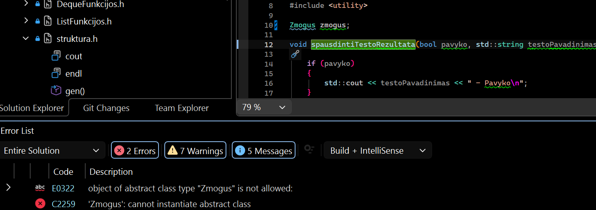
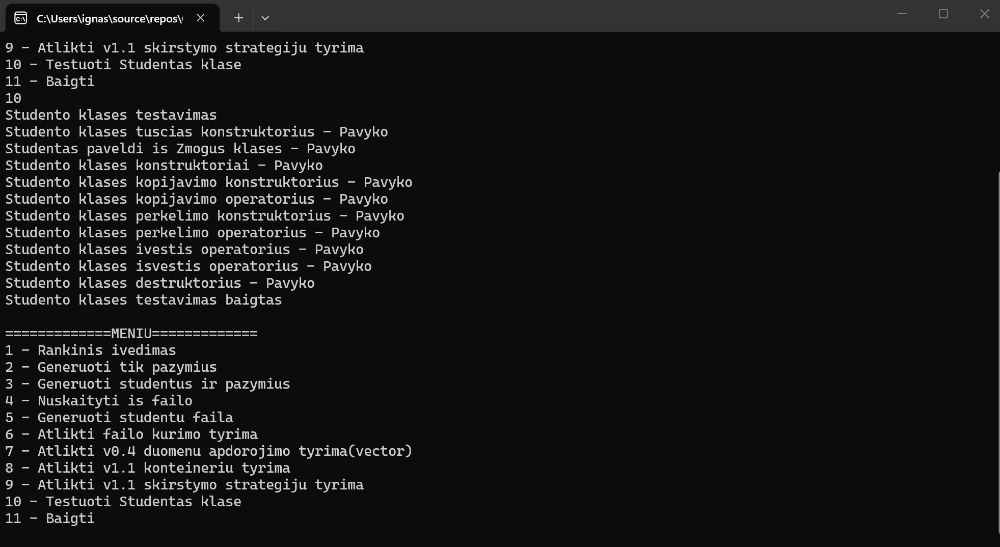

# Studentų pažymių skaičiavimo programa

## Programos funkcijos

Programa leidžia:

- rankiniu būdu įvesti studentų duomenis;
- generuoti pažymius;
- generuoti studentus ir jų pažymius;
- nuskaityti studentų duomenis iš failo;
- generuoti studentų failus;
- skaičiuoti galutinį balą pagal vidurkį arba medianą;
- rūšiuoti studentus pagal vardą, pavardę arba rezultatą;
- skirstyti studentus į dvi grupes;
- atlikti veikimo spartos tyrimus.

---

## Reikalavimai

- C++ kompiliatorius su C++17 palaikymu;
- CMake;
- Git.

---

## Programos įdiegimas ir paleidimas

Projekto atsisiuntimas:

```bash
git clone https://github.com/Boljerr/OOP_2.git
cd OOP_2
```

Kompiliavimas su CMake:

```bash
mkdir build
cd build
cmake ..
cmake --build .
```

Windows aplinkoje programa paleidžiama, pvz.:

```bash
.\Release\StudentaiV1.exe
```

Programa taip pat gali būti paleidžiama iš tos vietos, kurioje CMake sugeneruoja `.exe` failą.

---

## Meniu

```text
1 - Rankinis ivedimas
2 - Generuoti tik pazymius
3 - Generuoti studentus ir pazymius
4 - Nuskaityti is failo
5 - Generuoti studentu faila
6 - Atlikti failo kurimo tyrima
7 - Atlikti v0.4 duomenu apdorojimo tyrima(vector)
8 - Atlikti v1.1 konteineriu tyrima
9 - Atlikti v1.1 skirstymo strategiju tyrima
10 - Testuoti Studentas klase
11 - Baigti
```
---

---

## v1.5

Šioje versijoje programa papildyta paveldėjimu. Sukurta abstrakti bazinė klasė `Zmogus`, iš kurios paveldi `Studentas` klasė.

Programa išlaiko v1.2 versijos logiką: veikia `Rule of Five`, įvesties/išvesties operatoriai ir ankstesni testai.

### Pagrindiniai pakeitimai

| Pakeitimas | Aprašymas |
|---|---|
| Sukurta `Zmogus` klasė | Saugo bendrus žmogaus duomenis: vardą ir pavardę |
| `Zmogus` padaryta abstrakti | Tiesiogiai `Zmogus` objektų kurti negalima |
| `Studentas` paveldi iš `Zmogus` | `Studentas` perima vardą ir pavardę iš bazinės klasės |
| Išlaikyta v1.2 logika | Veikia `Rule of Five` ir `>>`, `<<` operatoriai |
| Atnaujinti testai | Patikrintas paveldėjimas ir v1.2 metodai |

### Abstrakčios klasės patikrinimas

`Zmogus` klasė yra abstrakti, nes turi grynai virtualius metodus:

```cpp
virtual void read(std::istream& in) = 0;
virtual void print(std::ostream& out) const = 0;
```

Bandant sukurti `Zmogus` objektą:

```cpp
Zmogus zmogus;
```

gaunama kompiliavimo klaida. Tai parodo, kad bazinės klasės objektų tiesiogiai kurti negalima.



### Paveldėjimo patikrinimas

`Studentas` objektą galima naudoti per `Zmogus` rodyklę:

```cpp
Studentas s1("Jonas", "Jonaitis", pazymiai, 7);
Zmogus* zmogus = &s1;
```

Tai parodo, kad `Studentas` yra išvestinė klasė iš `Zmogus`.

### Testų rezultatai

Testų rezultatai pateikti nuotraukoje:



## Relizų aprašas

## v1.2

Šioje versijoje `Studentas` klasė papildyta „Rule of Five“ realizacija. Pridėtas destruktorius, kopijavimo konstruktorius, kopijavimo operatorius, perkėlimo konstruktorius ir perkėlimo operatorius.

Taip pat realizuoti įvesties ir išvesties operatoriai `>>` ir `<<`, leidžiantys patogiau nuskaityti ir išvesti studento duomenis. Papildomai parašyti testai, kurie patikrina konstruktorius, operatorius ir kitus pagrindinius klasės metodus.

### v1.1

- `Studentas` struktūra pakeista į klasę.
- Studentų duomenys perkelti į privačius laukus.
- Pridėti getteriai ir setteriai.
- Realizuoti konstruktoriai ir destruktorius.
- Atnaujintos funkcijos, kurios dirba su `Studentas` objektais.
- Atliktas `struct` ir `class` versijų palyginimas.
- Atlikta analizė su `O1`, `O2` ir `O3` optimizavimo flag'ais.
- README faile pateikti greičio ir `.exe` dydžio rezultatai.

### v1.0

- Pridėtas darbas su trimis konteineriais:
  - `std::vector`;
  - `std::list`;
  - `std::deque`.
- Pridėtos trys studentų skirstymo strategijos.
- Atliktas konteinerių tyrimas.
- Atliktas skirstymo strategijų tyrimas.
- Paruoštas `CMakeLists.txt`.

### v0.4

- Pridėtas studentų failų generavimas.
- Pridėtas studentų skirstymas į dvi grupes.
- Atliktas pradinis veikimo spartos tyrimas su `std::vector`.

### v0.3

- Patobulinta įvesties validacija.
- Pridėtas klaidų tikrinimas.
- Kodas išskaidytas į `.h` ir `.cpp` failus.

### v0.2

- Pridėtas duomenų nuskaitymas iš failo.
- Pridėtas studentų rūšiavimas.

### v0.1

- Realizuotas rankinis studentų duomenų įvedimas.
- Pridėtas galutinio balo skaičiavimas pagal vidurkį arba medianą.

### v.pradinė

- Sukurta pradinė studento duomenų struktūra.
- Realizuotas pradinis vidurkio ir medianos skaičiavimas.